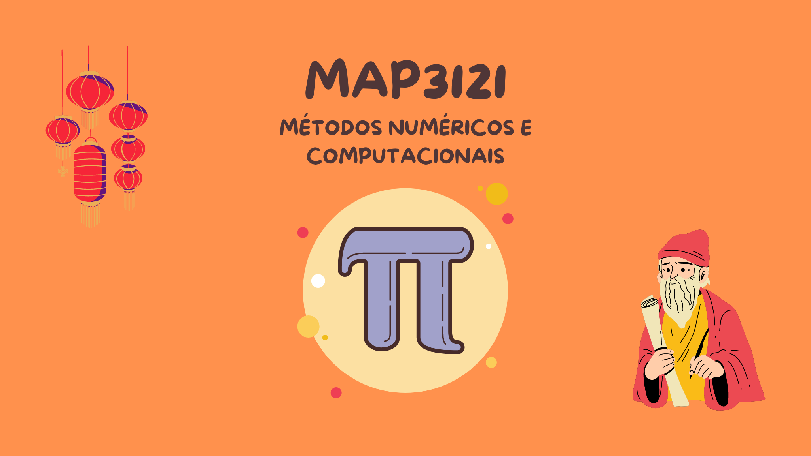

<h1 align="center">
  
</h1>

<h1 align="center">Métodos Numéricos e Computacionais</h1>

<h1 align="center">
    <a href="https://www.ime.usp.br/~map3121/">🔗 MAP3121 - IME</a>
</h1>
<p align="center">🚀 Informações do cursos e materiais</p>


<p align="center">
 <a href="#objetivo">Objetivo</a> •
 <a href="#roadmap">Roadmap</a> • 
 <a href="#tecnologias">Tecnologias</a> • 
 <a href="#contribuicao">Contribuição</a> • 
 <a href="#licenc-a">Licença</a> 
</p>

<h4 align="center"> 
	🚧  🚀 Em construção...  🚧
</h4>

### Pré-requisitos

Antes de começar, você vai precisar ter instalado em sua máquina as seguintes ferramentas:
[Git](https://git-scm.com), [Node.js](https://nodejs.org/en/). 
Além disto é bom ter um editor para trabalhar com o código como [VSCode](https://code.visualstudio.com/)

### 🎲 Rodando a Aplicação (Jupyter notebooks)

```bash
# Clone este repositório
$ git clone <https://github.com/lucascarvalho10/projeto-pef-3208>

# Acesse a pasta do projeto no terminal/cmd
$ cd project

# Instale as dependências
$ pip install

# Abra os Notebooks do Jupyter
$ jupyter notebook

# O notebook abrira no Anaconda
```
		  

### 🛠 Tecnologias

As seguintes ferramentas foram usadas na construção do projeto:

- [Pandas](https://pandas.pydata.org/)
- [Numpy](https://numpy.org/)
- [SciPy](https://scipy.org/)

